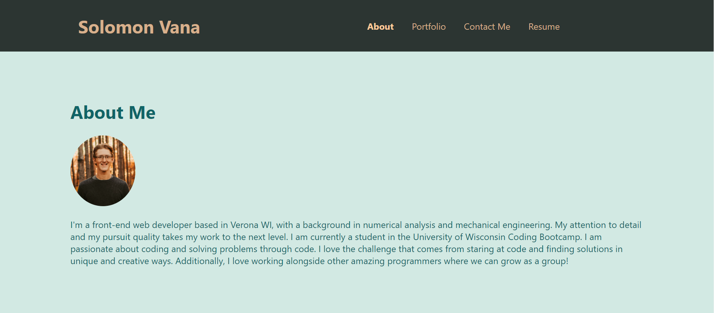

# reactPortfolio

## Description

This portfolio was created with the intent of creating a quality networking tool that shows off my skill and experience as a coder. Additionally it allowed to used **react**. This portfolio will help me better showcase my work and abilities. This portfolio allowed me to better learn react along with its different components.

## Screenshot

## Portfolio

[Link to Solomon's portfolio](https://solomon-coding.github.io/reactPortfolio/)

## Credits

For the design of the navbar I referenced the following link: 
 - https://www.geeksforgeeks.org/how-to-create-a-multi-page-website-using-react-js/ 

For the color scheme I referenced the following links:
 - https://visme.co/blog/website-color-schemes/

 - https://coolors.co/2c67b5-01161e-bfd1e5-849324-399e5a

For the *GitHub*, *Stack Overflow*, and *LinkedIn* icons, I used the following links:
 - https://www.veryicon.com/icons/internet--web/logos

 - https://isotropic.co/tool/hex-color-to-css-filter/

I used the following link for the contact form:

 - https://medium.com/weekly-webtips/simple-react-contact-form-without-back-end-9fa06eff52d9 

## License

MIT.